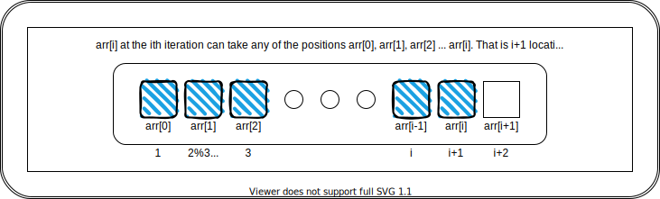
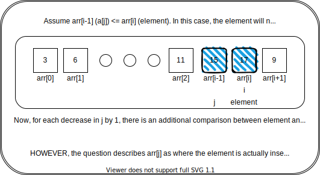

# Practice 1-B

[Back to root folder](/../../)
## About
---
Programming assignment in C++ to analyse performance of sorting algorithms like `Insertion Sort`.

## Tasks
---

Consider the following algorithm for insertion sort
Algorithm 1: 
```
Insertion sort(A, n)
input : Array: A[1], A[2]..., A[n]
output: Sorted array; A[1] ≤ A[2] ≤ ..... ≤ A[n]
1 for i: 2 to n do
2 Insert(A[1 . . . i − 1], i) 
  // function searches for an appropriate location j to insert A[i] in A[1 . . . i − 1] so that A[1 . . .i] is sorted.
  // It also inserts A[i] in the jth location.
3 end
```
1. What are the possible locations that `A[i]` may take in the `ith` iteration?



2. What is the number of comparisons performed by `Insertion Sort` to insert `A[i]` in location `j`. Give your answer in terms of `i` and `j`.



3. Run Insert(A[1...i − 1], i) for `i` = 4 for all possible permutations of 1, 2, 3,
4. For every `j` = 1, 4, list down the instances (the permutations) in which `A[i]` is inserted at the `jth` location. What do you observe? Now argue: the probability that `A[i]` will be inserted at the `jth` location is 1/`i`.
  - a) For every `i` = 1, 4, Compute the average/expected number of comparisons performed by `Insertion Sort` to insert `A[i]`. Average is taken over all possible permutations.
  - b) For every `i` = 1, 4, compute the probability that in the `ith` iteration, `A[i]` will be inserted in the `jth` location `j` = 1 . . .?
  Make a 2d table `P` with `i` at the rows and `j` at the columns where `P[i, j]` stores the above probability.

  - c) Repeat part (a) using the probabilities computed in part (b).
4. Consider a random input sequence. What is the probability that in the `ith` iteration, `A[i]` will be inserted in the `jth` location for `j` = 1 . . . `i`? Give your answer in terms of `i` (and `j` if required).